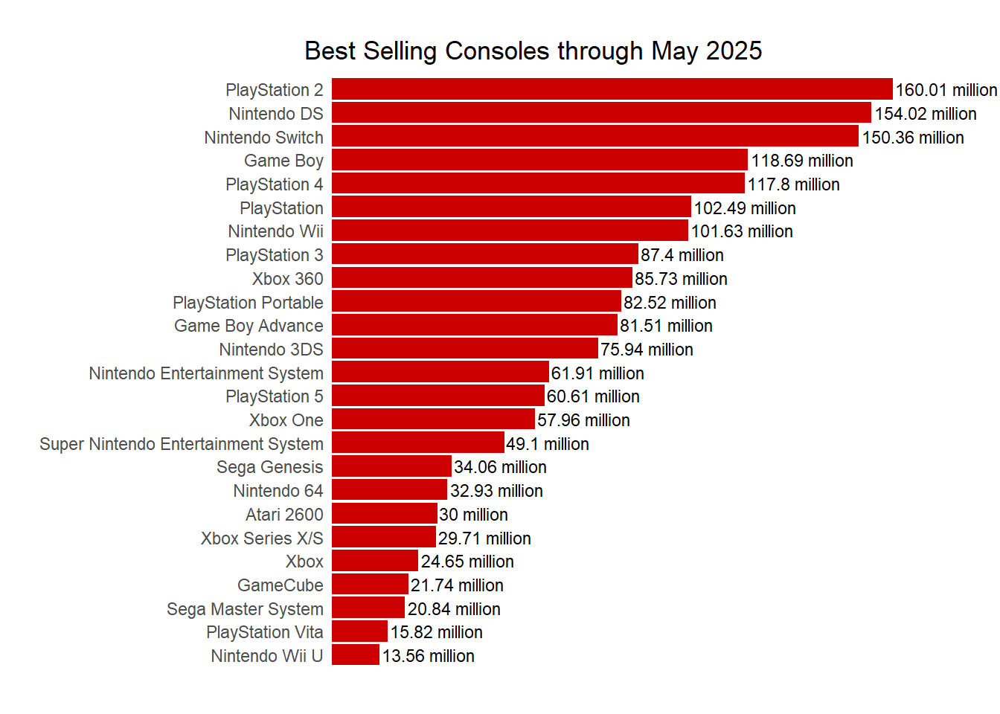
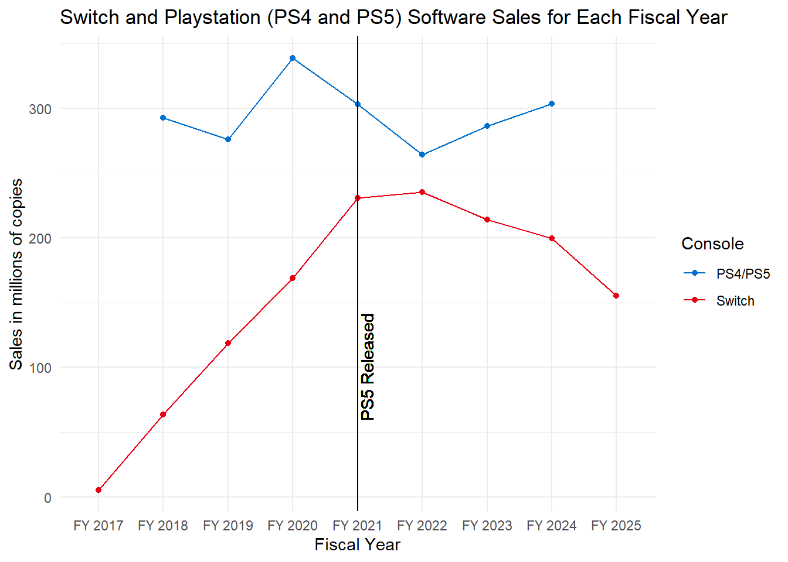
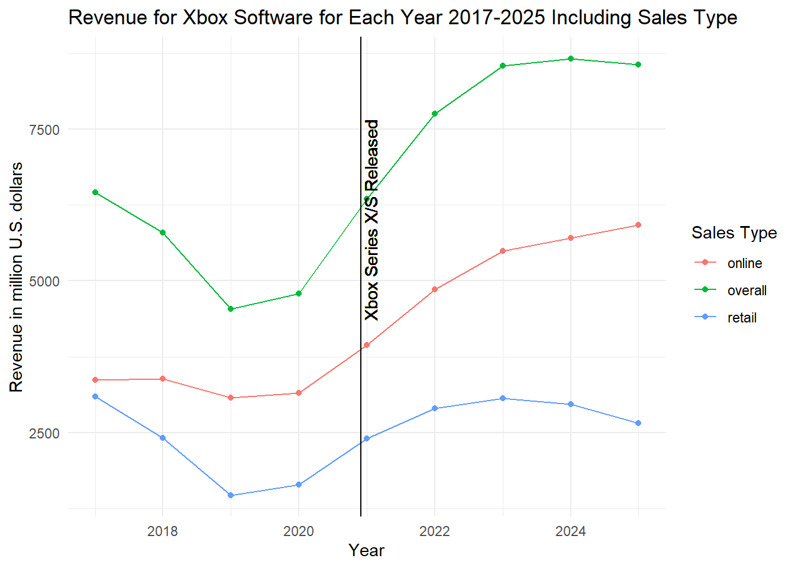
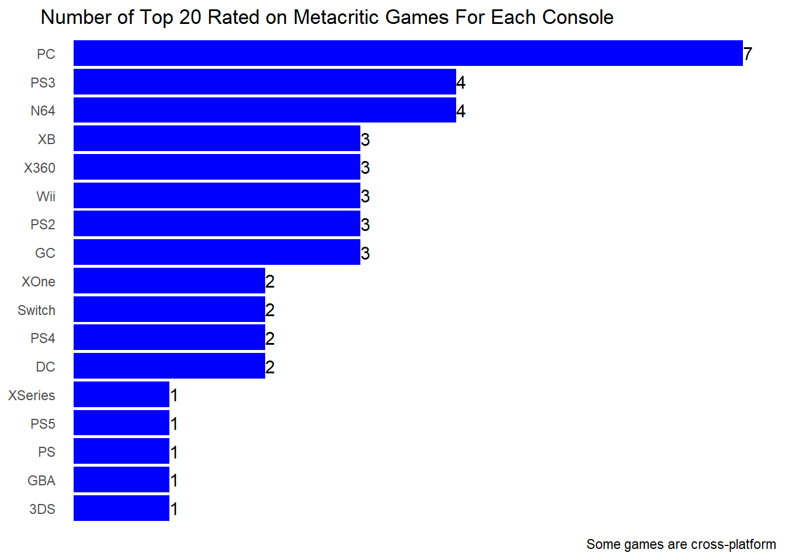

::: {.cell}

```{.r .cell-code}
library(tidyverse)
library(readxl)
library(ggtext)
```
:::


# Introduction

Welcome to my Semester Project! For my semester project, I decided to try to figure out what is the best video game console based on a couple of different factors. These factors are number of console sales, number of software sales per console, and how many of the top-rated games are on each console. These are the factors in which I used to be able to answer this question. I had a lot of fun doing this, finding and tidying data, summarizing data, and making graphs. I did this topic because I generally wanted to know what was the best video game console of all time by not just looking at overall console sales. With the introduction out of the way, lets start off by looking at console sales.

# Console Sales

This section shows you the best selling consoles of all time. Below is a bar graph showing you what the best selling consoles of all time are.


::: {.cell}

```{.r .cell-code}
consolesales <- read_xlsx("data/lifetimesalesofvideogameconsoles.xlsx", sheet = 2) %>% 
  rename("Console" = `Lifetime sales of video game consoles worldwide 2025`,
         "Sales" = ...2) %>% 
  drop_na()

consolesales %>% 
  ggplot(aes(x = Sales, y = fct_reorder(Console, Sales))) +
  geom_col(fill = "red3") +
  geom_text(aes(label = paste0(Sales, " million")),
            hjust = -0.025,
            size = 3) +
  labs(
    title = "Best Selling Consoles"
  ) +
  theme_minimal() +
  theme(
    axis.title = element_blank(),
    panel.grid = element_blank(),
    axis.text.x = element_blank(),
    plot.margin = margin(20, 40, 20, 20),
    axis.text.y = element_text(margin = margin(r=-12.5), hjust = 1)
  ) +
  coord_cartesian(clip = "off")
```

::: {.cell-output-display}
{width=672}
:::
:::


As you can see, this is graph is showing the best 25 selling consoles of all time. I believe that this is a good cut of because both the last two consoles the Playstation Vita, and the Nintendo Wii U were considered massive failures by those two companies. As you can see, the Playstation 2 is the best selling console of all time selling 160.01 million units. With the Nintendo DS in second place at 154.02 million units and the Nintendo Switch in third place at 150.86 million units which is still currently being sold even though the Nintendo Switch 2 just came out. Now, if this was based on just consoles sold the best console would be the Playstation 2 but there are a couple other factors to this.

# Software Sales

I will now compare the software sales of each of the different consoles.

## Before 2017

You may be wondering why do you have a before 2017 section. This is because this particular dataset only had games that were released before 2017 and I still wanted to use this dataset so thats why I split this up into two sections.


::: {.cell}

```{.r .cell-code}
softwaresales <- read_csv("data/vgsales.csv")

softwaresales %>% 
  ggplot(aes(x = Global_Sales, y = Platform)) +
  geom_boxplot() +
  geom_point() +
  scale_x_log10(breaks=c(1e-02, 1e-01, 1e+00, 1e+01, 1e+02), labels = c("10,000", "100,000", "1,000,000", "10,000,000", "100,000,000")) +
  theme_minimal() +
  theme(
    axis.ticks = element_line(),
    axis.line = element_line()
  ) +
  labs(
    y = "Console",
    x = "Global Sales",
    title = "Distribution of Sales per Game for Each Console",
    subtitle = "Data from 2017"
  )
```

::: {.cell-output-display}
{width=672}
:::
:::


As you can see, here is a graph that represents all of the games on each console's sales. Since, some of the games have way more sales than a lot of the games I decided to scale using log 10 on the x axis. For example, the Nintendo Wii, as you can see, has a game that sold a lot more copies than most of the other games which I am pretty sure is Wii Sports. As you can see, though there are a lot of consoles that have means higher than the other ones. I think this could be because of the amount of games that each console has. For example, the Atari 2600 has the highest mean, however, it seems that there may have not been as many games on that console compared to other ones. This seems to be apparent with the Wii U as well. However, looking at the top 25 consoles on this graph the Playstation 3, SNES, Xbox 360, Nintendo 64, and Gameboy have higher means than the others. This could mean that these consoles had better software sales than other consoles. 

## After 2017

After 2017, is split up into two graphs because Sony and Nintendo had exact software units sold while Xbox only had revenue of software. 


::: {.cell}

```{.r .cell-code}
switchsoftwaresales <- read_xlsx("data/nintendoswitchsoftware.xlsx", sheet = 2) %>% 
  rename("FYear" = `Nintendo Switch software unit sales 2017-2025`,
         "SoftwareSales" = ...2) %>% 
  drop_na() %>% 
  mutate(doubledigityear = str_extract(FYear, pattern = "[:digit:]+"),
         FiscalYear = paste0("FY 20", doubledigityear),
         Console = "Switch") %>% 
  select(FiscalYear, SoftwareSales, Console)

playstationsoftware <- read_xlsx("data/sony-playstation-software-sales-2018-2024.xlsx", sheet = 2) %>% rename("FiscalYear" = `Sony PlayStation full-game and first party software unit sales 2018-2024`, "SoftwareSales" = ...2) %>% 
  drop_na() %>% 
  mutate(
    Console = "PS4/PS5"
  ) %>% 
  select(FiscalYear, SoftwareSales, Console)

currentsoftware <- rbind(switchsoftwaresales, playstationsoftware) %>% 
  mutate(SoftwareSales = as.numeric(SoftwareSales))

currentsoftware %>% 
  ggplot(aes(x = FiscalYear, y = SoftwareSales, color = Console, group = Console)) +
  geom_line() +
  geom_point() +
  geom_vline(xintercept = "FY 2021") +
  geom_text(aes(x = "FY 2021", y = 100, label = "PS5 Released"), color="black", angle=90, vjust = 1.2, text=element_text(size=11)) +
  scale_color_manual(values = c("#006FCD", "#E60012")) +
  labs(
    x = "Fiscal Year",
    y = "Sales in millions",
    title = "Switch and Playstation (PS4 and PS5) Software Sales for Each Fiscal Year"
  ) +
  theme_minimal()
```

::: {.cell-output-display}
{width=672}
:::
:::


As you can see, this graph compares the Nintendo Switch to the Playstation 4 and Playstation 5 in software sales. As you can see, overall the Playstation 4 and 5 has better software sales than the Nintendo Switch. I think this may be because people only bought a Nintendo Switch to play first party games rather than third party games. While people bought a PS4 and PS5 to play both first party and third party games because those consoles are more powerful than a Nintendo Switch. So the Switch is a great place to play first party games but not a great way to play third party games. Comparing this to the PS4 mean in the first graph I think that this means that in software sales I think that the Nintendo Switch did worse than the PS4 in terms of software sales.


::: {.cell}

```{.r .cell-code}
xboxsoftware <- read_excel("data/xbox-software-sales.xlsx", sheet = 2) %>% 
  rename("year" = `Xbox gaming software sales revenues worldwide 2012-2025, by type`,
         "retail" = ...2,
         "online" = ...3) %>% 
  drop_na() %>% 
  mutate(year = as.numeric(str_extract(year, "[:digit:]+")),
         retail = as.numeric(retail),
         online = as.numeric(online),
         overall = retail + online) %>% 
  filter(year >= 2017) %>% 
  pivot_longer(cols = 2:4, names_to = "sales_type", values_to = "sales")

xboxsoftware %>% 
  ggplot(aes(x = year, y = sales, color = sales_type, group = sales_type)) +
  geom_line() +
  geom_point() +
  geom_vline(aes(xintercept = 2020.9166667)) +
  geom_text(aes(x= 2020.9166667, y=6000, label = "Xbox Series X/S Released"), angle = 90, vjust=1.2, color = "black") +
  labs(
    y="Revenue in million U.S. dollars",
    x="Year",
    title = "Revenue for Xbox Software for Each Year 2017-2025 Including Sales Type",
    color = "Sales Type"
  ) +
  theme_minimal()
```

::: {.cell-output-display}
{width=672}
:::
:::


As you can see, this graph shows the revenue of Xbox software for each sales type which are retail, online, and the overall sales. I think that Xbox only provides information for revenue because Xbox within these years created Game Pass which means that people don't buy the game they rather pay for a subscription to play particular games. This is why I think that it is more based off of revenue. From looking at the graph Xbox has shown a lot more revenue over the years so I think that the software sales for the Xbox Series X/S are much better than a lot of the other consoles because of the amount they have made because of Game Pass.

# Top Rated Games

The next graph shows how many games each console has that are in the top 20 rated games on Metacritic which is a review website the reviews things like video games, movies, music and more. I think that this is a big factor because the better the games a console has the better that console would be.


::: {.cell}

```{.r .cell-code}
bestsellingswitch <- read_xlsx("data/topsellingnintendoswitchgames.xlsx", sheet = 2) %>% 
   rename("Name" = `Top selling Nintendo Switch games worldwide 2025`,
         "Global_Sales" = ...2) %>% 
  drop_na() %>% 
  mutate("Platform" = "Switch",
         "Publisher" = "Nintendo",
         "Rank" = NA,
         "Genre" = NA,
         "Year" = NA,
         "NA_Sales" = NA,
         "EU_Sales" = NA,
         "JP_Sales" = NA,
         "Other_Sales" = NA)
  

topratedvideogames <- read_xlsx("data/topratedvideogamesofalltime.xlsx", sheet = 2) %>% 
  rename("gameyear" = `Top-rated video games of all time 2025`,
         "rating" = ...2) %>% 
  drop_na() %>% 
  mutate(
    splitstring = str_split_fixed(gameyear, pattern = " \\(", 2),
    game = splitstring[,1],
    year = str_extract(splitstring[,2], pattern = "[:digit:]+")
  ) %>% 
  select(-c(splitstring, gameyear))

gtavrdd2plat <- read_excel("data/gtavandrdd2platforms.xlsx") %>% 
  mutate("Publisher" = NA,
         "Rank" = NA,
         "Genre" = NA,
         "Year" = NA,
         "NA_Sales" = NA,
         "EU_Sales" = NA,
         "JP_Sales" = NA,
         "Global_Sales" = NA,
         "Other_Sales" = NA)
  

softsalessw <- rbind(softwaresales, bestsellingswitch, gtavrdd2plat)

jointoprated <- topratedvideogames %>% 
  left_join(softsalessw, join_by(game == Name))

consoletopratedgames <- jointoprated %>% 
  group_by(Platform) %>% 
  summarise(numberoftopratedgames = n()) %>% 
  drop_na()

consoletopratedgames %>% 
  ggplot(aes(x=numberoftopratedgames, y=fct_reorder(Platform, numberoftopratedgames))) +
  geom_col(fill = "blue") +
  geom_text(aes(label = numberoftopratedgames),
            hjust = 0,
            size = 4) +
  labs(
    title = "Number of Top 20 Rated on Metacritic Games For Each Console"
  ) +
  theme_minimal() +
  theme(
    axis.title = element_blank(),
    panel.grid = element_blank(),
    axis.text.x = element_blank(),
    axis.text.y = element_text(margin = margin(r=-12.5), hjust = 1)
  )
```

::: {.cell-output-display}
{width=672}
:::
:::


As you can see, the PC has the most top 20 rated games, however, the PC is not a console so we will ignore that. If you are going for consoles though, the PS3 and the N64 have the highest number of top 20 rated games at 4 games with the Xbox, Xbox 360, Wii, PS2, and Gamecube being next at 3 games. As you can see, there are some consoles that do not have any of the highest rated games such as the Gameboy.

# Final Analysis

I think that looking at the graphs overall the best console might be the Playstation 3. This is because it is the 8th best selling console of all time, it has a great mean of sales on each of the games and it also has 4 games that are on the list for the top 20 rated games so it has pretty enjoyable games. It is not the Gameboy because although it is pretty high in console sales and software sales it does not have any games that are in the top 20. I guess you can also debate that the Playstation 2 is the best console of all time because it has a relatively high mean for software sales, it has 3 of the top 20 rated games, and it is the best selling console of all time, but depending on the data I think that it is the Playstation 3. However, in the end, I do think it depends on the factors that you are using to find out what is the best video game console. 


